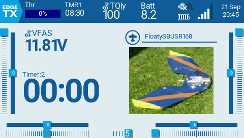
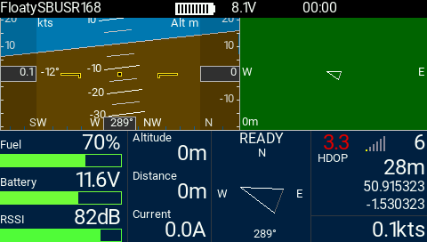
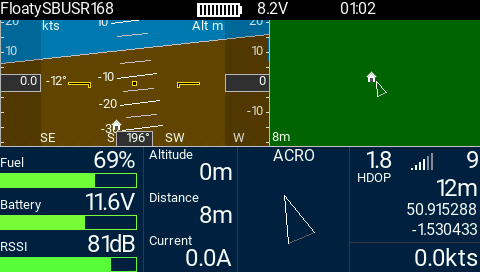
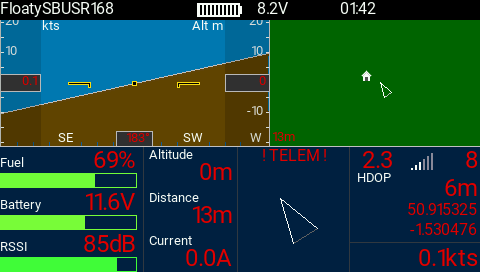

## INAV Lua Telemetry Flight Status fork for EdgeTX / Horus, TX16S etc.

This fork works for EdgeTX (2.5 dev of 2021-09-20 and later) and TX16S (Horus). It may not work elsewhere; specifically, it is not backwards compatible with OpenTX. Nivana has also been updated, but is untested.

* Colours are somewhat correct
* The main screen is not corrupted
* Prefers compilation on the TX, avoiding incompatible Lua binary formats

#### Installation

* Install the official inav / OpenTX [release](https://github.com/iNavFlight/OpenTX-Telemetry-Widget)
* Copy the `*.lua` files from here into the respective target directories
* Delete the corresponding `*.luac` files; they will be recreated

#### In use

Some bench test images:

#### Apologies and embarassment

This is _so_ ugly. This hack replaces the original module's overwriting of the system theme colours with colours specific to the telemetry module. It's far too horrible to offer as an upstrem PR ... maybe someone competent will be inspired to fix it properly.

#### Official Documentation

Please refer to the [OpenTX INAV telemetry widget page](https://github.com/iNavFlight/OpenTX-Telemetry-Widget).
